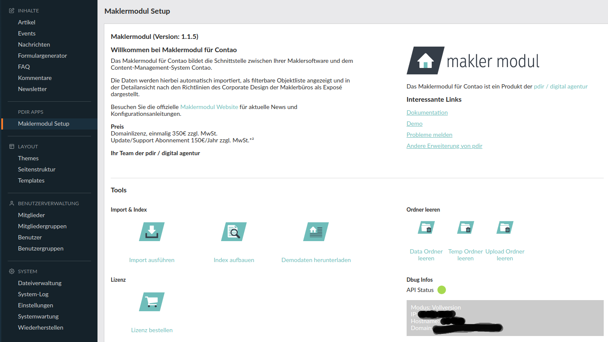

# Dateien für die Immobiliendaten hochladen

Sie haben die Möglichkeit **eigene Immobiliendaten** oder die **Demodaten** zu importieren. Eigene Immobiliendaten können Sie nur mit der Vollversion importieren.

Wenn Sie zuerst die **Demodaten herunterladen** wollen, wählen Sie in der linken Navigation unter PDIR APPS den Menüpunkt Maklermodul Setup aus und klicken auf den Button Demodaten herunterladen. Anschließend finden Sie die Demodaten in der Dateiverwaltung unter dem Ordner maklermodul/data.

## Eigene Immobiliendaten importieren

Nach der Installation befinden sich unter Backend-Module **System** im Punkt **Dateiverwaltung** ein neues Verzeichnis **maklermodul**. In diesem Ordner müssen **3 weitere Verzeichnisse** mit folgenden Namen enthalten sein: **data, org, upload**.

Um die zip-Datei hochzuladen, muss auf **Datei-Upload** geklickt werden. Die Ansicht ändert sich und es muss rechts von Upload das Icon **In dieses Verzeichnis einfügen** geklickt werden. Unter **Dateiupload** den Button **Dateien auswählen** betätigen. Danach die **zip-Datei** wählen und unten rechts Button **Öffnen** klicken. Anschliessend den Button **Dateien hochladen** betätigen.

Jetzt sollte sich diese Datei im **Verzeichnis ‚upload‘** befinden.

## Hinweise

**Hochgeladene Datei ist zu groß:**

Wenn Die Datei aufgrund der Größe nicht importiert werden kann, wählen Sie in der linken Navigation den Menüpunkt _Einstellungen_ und erhöhen unter dem Reiter _Datei-Uploads_ den Wert für _Maximale Upload-Dateigröße_.

**jQuery wird nicht geladen:**

Vergewissern Sie sich, dass Sie jQuery geladen haben. Dies können hinzufügen, in dem Sie in der linken Navigation den Menüpunkt _Themes_ und anschließend das Icon für _Seitenlayouts_ auswählen. Wenn Sie das Layout bearbeiten, können Sie unter dem Reiter _jQuery_ jQuery laden.

**Files-Ordner anpassen oder Datei nach dem Import nicht erhalten:**

Wenn Sie das files-Verzeichnis geändert haben oder die importierte Datei nach dem Import erhalten möchten, können Sie in der _Dateiverwaltung_ unter dem Ordner maklermodul eine Datei mit dem Namen `import.ini` anlegen. Dann wird die zu importierende Datei nach dem Import im Ordner `maklermodul/org` abgelegt.

Die Datei könnte wie folgendermaßen aussehen. Mit der Anweisung `keep-source` können Sie einstellen, ob Sie die zu importierende Datei nach dem Import erhalten möchten oder nicht.

```
import-source="files/maklermodul/upload"
import-target="files/maklermodul/data"
keep-source="true"
```

## Import starten

Wenn Sie den Import manuell ausführen wollen, können Sie ihn über das Backend-Modul **Maklermodul Setup** starten, in dem Sie den Button** Import ausführen** klicken.



## Cronjob einrichten

Anbei die beiden Möglichkeiten für die Einrichtung des Crons:

### Poor-Man-Cron

Bitte folgende Datei unter **app/Resources/contao/config/config.php** anlegen wenn nicht vorhanden und folgenden Inhalt einfügen. Anschließend müssen Sie den Cache im Contao Manager neu aufbauen.

```
<?php

/**
 * Maklermodul Cron
 *
 * see documentation for details
 * https://docs.maklermodul.de/import.html
 *
 */
$GLOBALS['TL_CRON']['hourly'][] = array('Pdir\MaklermodulSyncBundle\Module\Sync', 'estateImport');
$GLOBALS['TL_CRON']['hourly'][] = array('Pdir\MaklermodulSyncBundle\Module\Sync', 'estateIndex');
```

Info: Diese Cronjobs werden wirklich nur ausgeführt, wenn die Webseite auch besucht wird.

**Mögliche Optionen für die Häufigkeit der Ausführung:**

$GLOBALS\['TL\_CRON'\]\['monthly'\]  
$GLOBALS\['TL\_CRON'\]\['weekly'\]  
$GLOBALS\['TL\_CRON'\]\['daily'\]  
$GLOBALS\['TL\_CRON'\]\['hourly'\]  
$GLOBALS\['TL\_CRON'\]\['minutely'\]

**Mehr Information zu den Cronjobs in Contao finden Sie hier: **

[https://docs.contao.org/books/cookbook/de/Cronjobs-in-Contao.html](https://docs.contao.org/books/cookbook/de/Cronjobs-in-Contao.html)

**Poor-Man-Cron regelmäßig ausführen:** \(Einrichtung je nach Hosting-Anbieter über die Oberfläche möglich\)

[https://example.org/\_contao/cron](https://example.org/_contao/cron)

Bitte beachten Sie, dass in den **Einstellungen** unter **Frontend-Einstellungen** die Checkbox **Den Command-Scheduler deaktivieren** nicht aktiviert sein darf, um den Poor-Man-Cronjob zu aktivieren.


### Echter Cronjob auf dem Server

**22 Minuten nach jeder vollen Stunde \(für hourly-Jobs\)**

22 \* \* \* \* wget -O /dev/null -q php php vendor/bin/contao-console maklermodul:import && php vendor/bin/contao-console maklermodul:index

### Manueller Aufruf über die Console

php vendor/bin/contao-console maklermodul:import  
php vendor/bin/contao-console maklermodul:index

