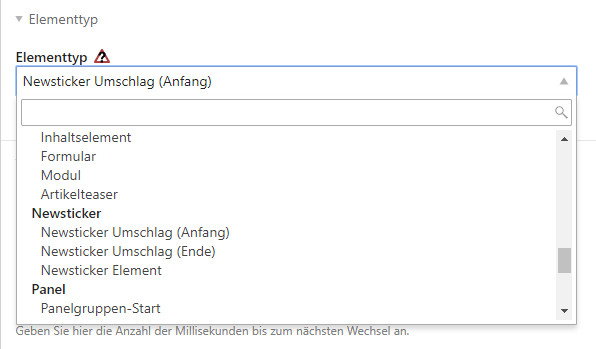
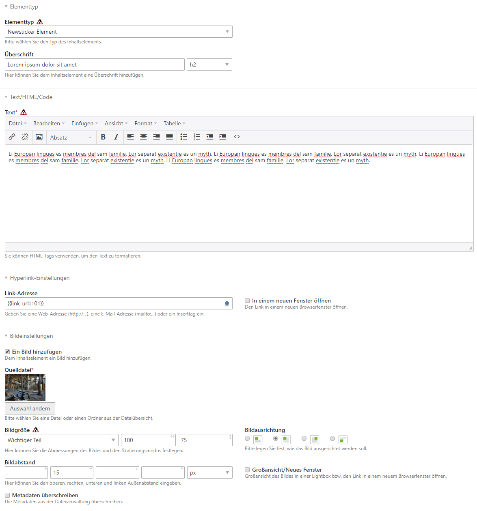

# Einrichtung

jQuery muss im Seitenlayout aktiviert sein!

## Umschlags-Elemente anlegen

Im ersten Schritt legen Sie jeweils ein Element vom Typ **Newsticker Umschlag (Anfang)** und 
**Newsticker Umschlag (Ende)** an.

Bei dem Element **Newsticker Umschlag (Anfang)** haben Sie diverse Konfigurationsmöglichkeiten:

| Eigenschaft | Beschreibung |
| ------------- | ------------- |
| Richtung | Wählen Sie hier aus in welche Richtung die Elemente verschoben werden sollen (nach oben / nach unten). | 
| Übergangsgeschwindigkeit | Hier kann die Übergangsgeschwindigkeit definiert werden. Werte: _slow_, _medium_, _fast_ oder ein Wert in Millisekunden. |
| Intervall | Geben Sie hier die Anzahl der Millisekunden bis zum nächsten Wechsel an. |
| Höhe | Hier kann die Höhe des Newsticker angepasst werden. Wird hier _auto_ eingetragen, passt sich die Höhe automatisch an. Es können auch Werte wie _200px_ oder _300px_ gesetzt werden. |
| Anzahl der sichtbaren Elemente | Hier können Sie die Anzahl der sichtbaren Elemente definieren. Tragen Sie 0 ein um alle Elemente anzuzeigen oder einen speziellen Wert wie 1, 2, 3 etc. |
| Anhalten bei Mouse Over | Den Newsticker pausieren, wenn der Nutzer mit der Maus über ein Element fährt. |
| Zeige Steuerungselemente an | Aktivieren Sie diese Option um die Steuerungselemente anzuzeigen (Nach oben, Nach unten, Abspielen, Pausieren). |

## Newsticker-Elemente anlegen

Innerhalb der Umschlagselemente platzieren Sie ein Element vom Typ **Newsticker Element**. Dort können Sie eine 
Überschrift, einen Text und ein Bild setzen. Unter Hyperlink-Einstellungen können Sie das gesamte Element auch 
verlinken.

Im Backend sollte die Struktur der Elemente etwa so aussehen:

## Beispiel

